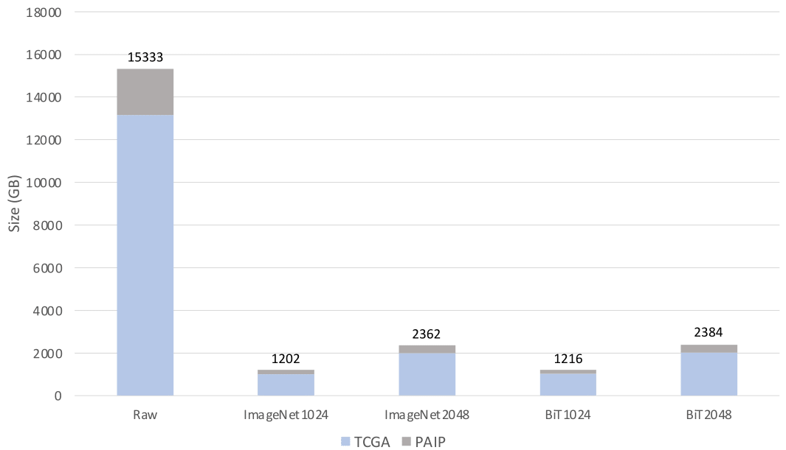

# PathContainer: Large-scale Patch-wise Pathological Image Feature Dataset with a Hardware-agnostic Feature Extraction Tool
The offical implementation of PathContainer, *MUIA 2022*


## Abstract
Recent advances in whole slide imaging (WSI) have transformed computer-aided pathological studies from small-scale (e.g., < 500 patients) to large-scale (e.g., > 10,000 patients). Moreover, a single whole slide image might yield Gigapixel resolution; thus, even basic preprocessing steps, such as foreground segmentation, tiling, and patch-wise feature extraction (e.g., via ImageNet pretrained models), can be computationally expensive. In our method, we present a large-scale patch-wise pathological image feature dataset, covering 14,000 WSIs from TCGA and PAIP cohorts. 
The contribution of this study is five-fold: 

(1) We release a foreground patch-level feature dataset called PathContainer; 

(2) The global spatial location of the patch-level features is provided to aggregate WSI-level results; 

(3) The feature dataset from two pretrained models (ImageNet and BiT) and two resolutions (1024 and 2048) are evaluated and released for flexible downstream analyses; 

(4) We containerize the foreground segmentation, tiling, and feature extraction steps to allow for convenient feature extraction; 

(5) When performing a standard weakly supervised segmentation method on 940 WSIs, 85.3% of computational time was saved using the PathFeature dataset.

## Dataset



The PathContainer dataset includes a total of 14000 WSIs, of which 11682 is from TCGA and 2318 is from PAIP.

The ImageNet pretrained ResNet50 model is employed, which utilizes adaptive mean-spatial pooling after the third block of ResNet50 in order to get feature vectors with a dimension of 1024 (i.e., ImageNet) or 2048 (i.e., ImageNet2048) after the fourth block. Beyond controlling the outputs' dimensionalities, we also employ the prevalent Big Transfer (BiT) model as another pretrained model. Similar to ImageNet1024 and ImageNet2048, both 1024 (i.e., BiT1024) and 2048 (i.e., BiT2048) dimensional vectors are provided by PathFeature.

The PathFeature dataset is available for
[Download](https://drive.google.com/drive/folders/1sBJBOEO8Mhf5kwu_wtvwUHA2qLWRQ9hO?usp=sharing)


## Quick Start
#### The Docker Image can be obtained by
```
docker pull zheyuzhu/pathcontainer:latest
```
#### Run PathContainer
You can use the following command lines or change the `input_dir`, then you will have the final result at `output_dir`
```
# Specify the input directory
export input_dir =./ PathContainer / input_dir
# Set the output directory
export output_dir =./ PathContainer / output_dir
# Set the configuration directory
export config_dir =./ PathContainer / config_dir
# Run the docker
sudo $config_dir / run_docker . sh $ { input_dir } $ { output_dir } $ { config_dir } $ { output_dir }/ log
```

## Detailed environment setting

#### Testing platform
- Ubuntu 16.04
- cuda 8.0
- Docker version 1.13.1-cs9
- Nvidia-docker version 1.0.1 to 2.0.3
- GPU: NVIDIA Quadro P5000 GPU

#### install Docker
```
sudo apt-get install apt-transport-https ca-certificates curl software-properties-common
curl -fsSL https://download.docker.com/linux/ubuntu/gpg | sudo apt-key add -
sudo add-apt-repository "deb [arch=amd64] https://download.docker.com/linux/ubuntu $(lsb_release -cs) stable"
sudo apt-get update
sudo apt-get install docker-ce
```

#### install Nvidia-Docker
```
curl -s -L https://nvidia.github.io/nvidia-docker/gpgkey | sudo apt-key add -
distribution=$(. /etc/os-release;echo $ID$VERSION_ID)
curl -s -L https://nvidia.github.io/nvidia-docker/$distribution/nvidia-docker.list | sudo tee /etc/apt/sources.list.d/nvidia-docker.list
sudo apt-get update
sudo apt-get install -y nvidia-docker2